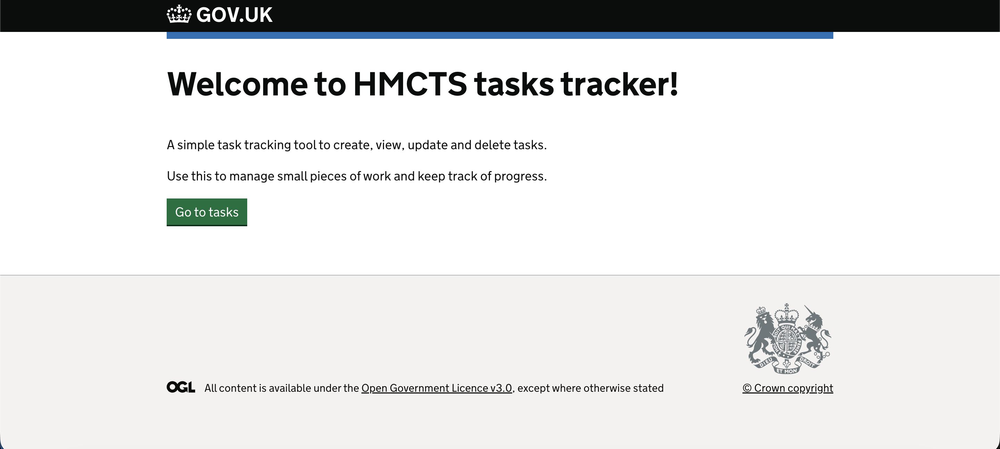
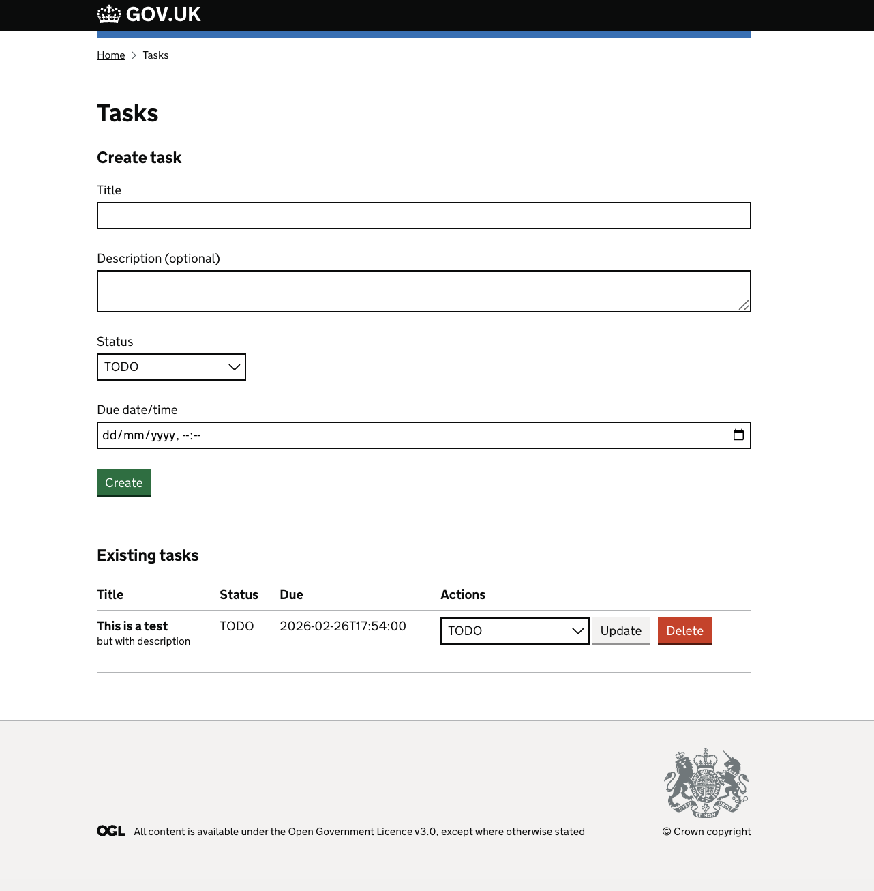

# HMCTS Dev Test Frontend – Tasks Tracker

Server-rendered Node/Express frontend (Nunjucks + GOV.UK Design System) for the HMCTS developer challenge.

## Features

- View tasks
- Create tasks
- Update task status
- Delete tasks

## Screenshots


### Home


### Tasks


## Prerequisites

- Node.js (LTS recommended)
- Yarn
- Backend running locally (see backend repo README)

## Running the app

From the `hmcts-dev-test-frontend` folder:

```bash
yarn install
yarn webpack
yarn start:dev
```
Then open:
https://localhost:3100/
